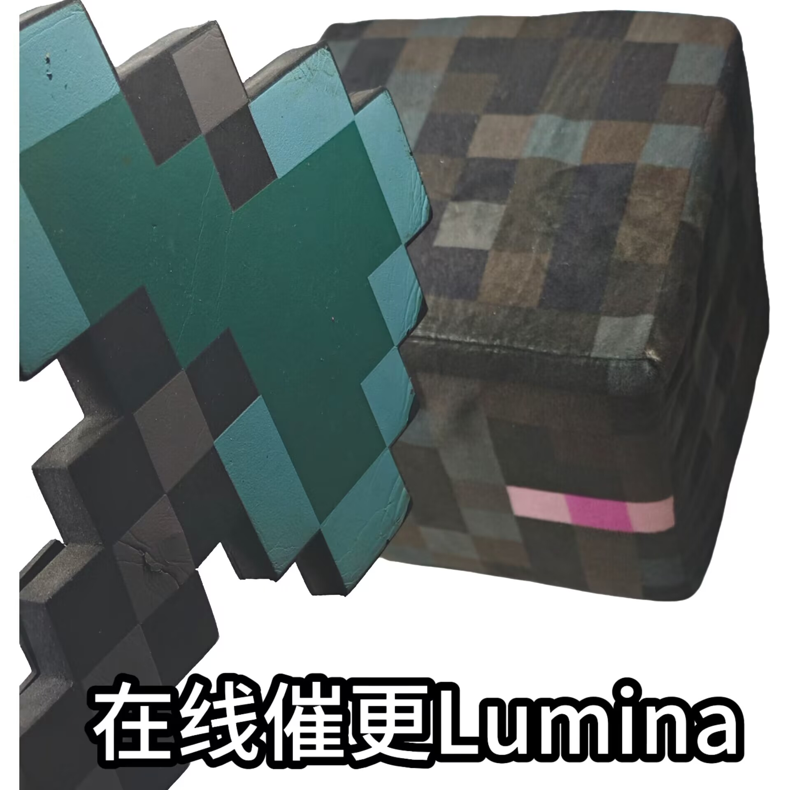
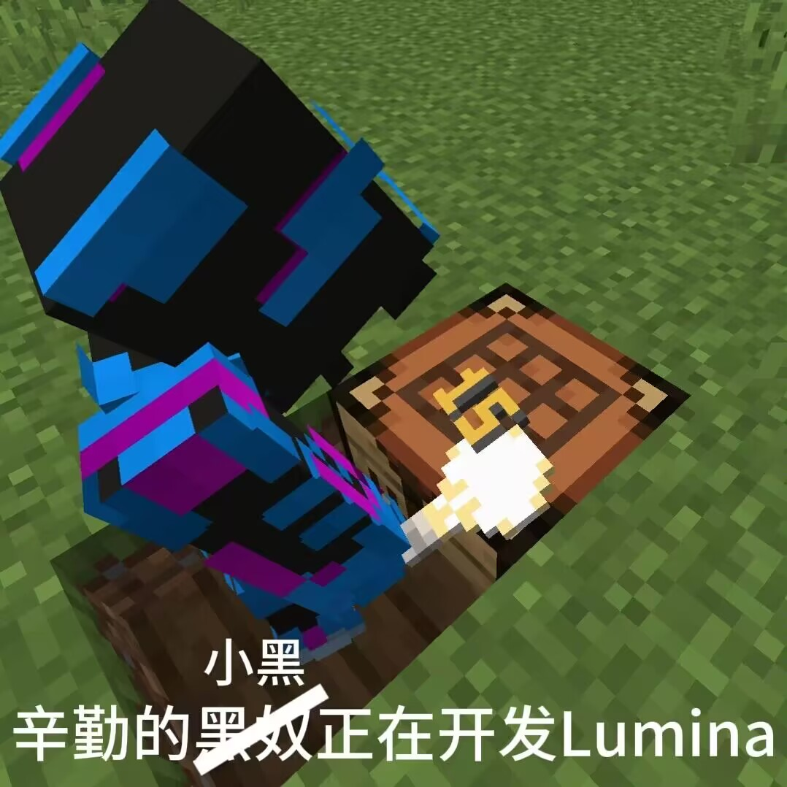

Lumina - 流明
===========

[English](./README.md) | **中文**

> 一个致力于修复原版服务端被破坏特性的 [Folia](https://github.com/PaperMC/Folia) 分支

**目前本项目并不稳定。**

我们正在收集 Folia 破坏的原版特性，如果你有发现，请在 issue 中提出，谢谢。

**你可以查看我们的[路线图](docs/RoadMap_ZH.md)来了解我们的开发计划**

**为了让默认时更符合 Vanilla 行为，我们修改了部分 Paper 与 Spigot 配置项的默认值，详见[修改列表](docs/DefaultModifiedConfigList.md)**

**[未完成]尽管 Lumina 移植了大多数的 Carpet 特性，但是仍然有部分特性不被支持，详见[被移除的 Carpet 特性](docs/RemovedCarpetFeatures_ZH.md)**

### 一些梗图 by Sun_HE

**下图并无任何种族歧视倾向 | There is no racial discrimination in the picture below**

