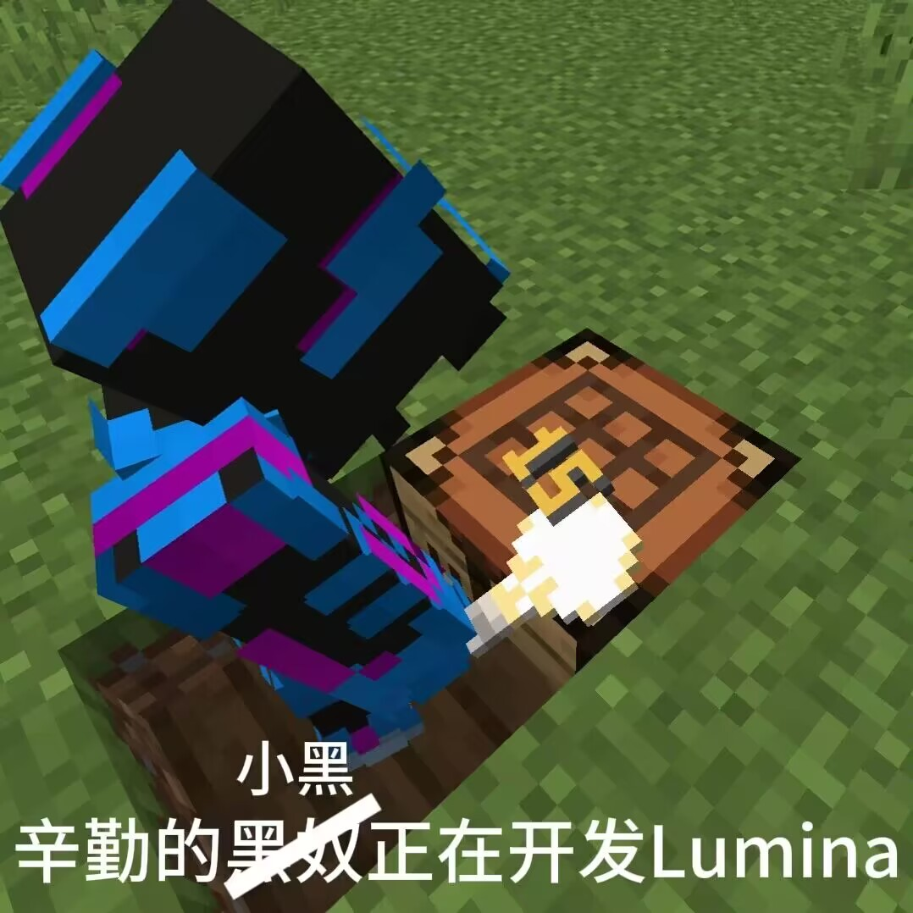

Lumina
===========

[English](./README.md) | **中文**

> 一个致力于修复原版服务端被破坏特性的 [Folia](https://github.com/PaperMC/Folia) 分支

**目前本项目并不稳定。**

我们正在收集 Folia 破坏的原版特性，如果你有发现，请在 issue 中提出，谢谢。

**为了让默认时更符合Vanilla行为，我们修改了部分Paper与Spigot配置项目的默认值，详见[修改列表](./ModifiedConfigList.md)**

**下图并无任何种族歧视倾向 | There is no racial discrimination in the picture below**

